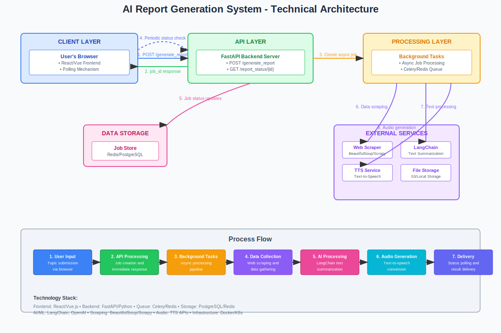

# Personal AI Journalist

A full-stack web application that acts as your personal AI-powered journalist. Provide any topic, and the application will search the web for the latest information, generate a concise news summary, and convert it into a ready-to-play audio report.

This project was built from the ground up to demonstrate a modern, robust, and scalable application architecture using a powerful stack of technologies including FastAPI, React, LangChain, and more.

## ✨ Core Features

- **Asynchronous Job Processing:** The backend immediately accepts requests and processes them in the background, providing a non-blocking user experience.
- **Real-time Web Search:** Utilizes LangChain with the DuckDuckGo search tool to gather up-to-the-minute information on any given topic.
- **AI-Powered Summarization:** Leverages a Large Language Model (LLM) via Groq's fast API to generate unique, coherent summaries.
- **Text-to-Speech Conversion:** Converts the generated text summary into a high-quality, natural-sounding audio report using the ElevenLabs API.
- **Real-time Polling:** The frontend polls the backend for job status updates, displaying progress to the user.
- **Modern, Responsive UI:** A sleek and user-friendly interface built with React, TypeScript, and styled with TailwindCSS & daisyUI.

## 🛠️ Tech Stack

### Backend

- **Framework:** [FastAPI](https://fastapi.tiangolo.com/)
- **Dependency Management:** [Poetry](https://python-poetry.org/)
- **AI Orchestration:** [LangChain](https://www.langchain.com/)
- **LLM Provider:** [Groq](https://groq.com/) (for Llama 3)
- **Text-to-Speech:** [ElevenLabs](https://elevenlabs.io/)
- **Web Search:** DuckDuckGo (via `langchain-community`)

### Frontend

- **Framework:** [React](https://react.dev/) with [Vite](https://vitejs.dev/)
- **Language:** [TypeScript](https://www.typescriptlang.org/)
- **Styling:** [TailwindCSS](https://tailwindcss.com/) & [daisyUI](https://daisyui.com/)

## 🏛️ Architecture Overview

  

This application uses a non-blocking architecture to handle potentially long-running AI tasks.

